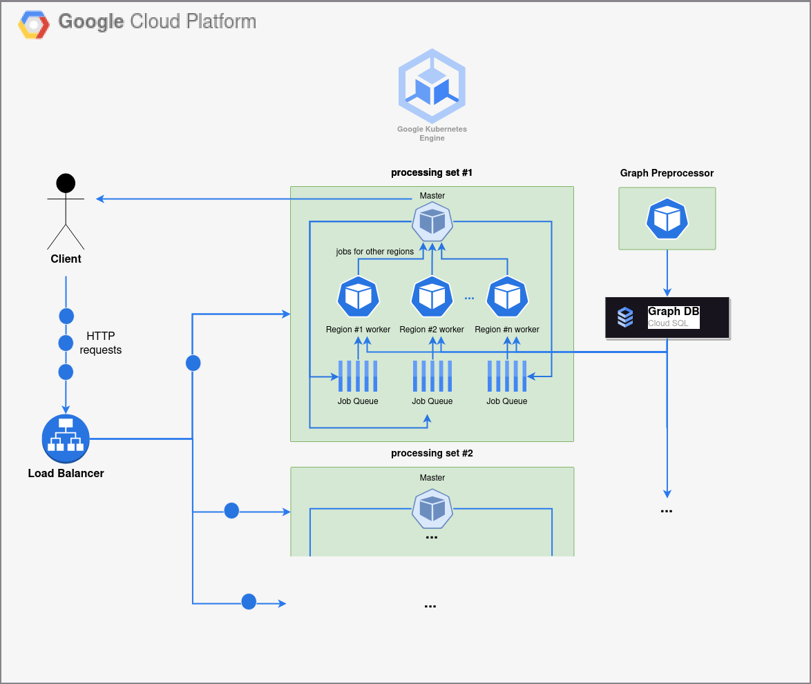

# What is this?

This is a repository of our group project for the [Engineering Distributed Infrastructure (Inżynieria Rozproszonej Infrastruktury Obliczeniowej / IRIO)](https://usosweb.mimuw.edu.pl/kontroler.php?_action=katalog2/przedmioty/pokazPrzedmiot&prz_kod=1000-2M20IRIO) elective offered by the Faculty of Mathematics, Informatics and Mechanics at the University of Warsaw (further referred to as "MIM UW") in the 2022/2023 winter semester.

# Task Description
The exact problem description we received can be found [here](task_description.pdf).

In our solution, we incorporated graph partitioning as described in [this paper](https://www.researchgate.net/publication/221131524_Partitioning_Graphs_to_Speed_Up_Dijkstra%27s_Algorithm), choosing a single-level [K-means clustering](https://en.wikipedia.org/wiki/K-means_clustering) strategy.

Our sparse graph of choice was [the map of Monaco](https://download.geofabrik.de/europe/monaco.html).

We wrote most of the project in C++ (plus some Python scripts for graph pre-processing, uploading it to a Postgres database and hosting a Flask server), using GRPC as the communication protocol between components and finally deployed on Google Kubernetes Engine.

A high-level diagram of our system:

 

A detailed description of our system's control flow can be found [here](solution_description.md).

---
Copyright of the task's description and resources: MIM UW.